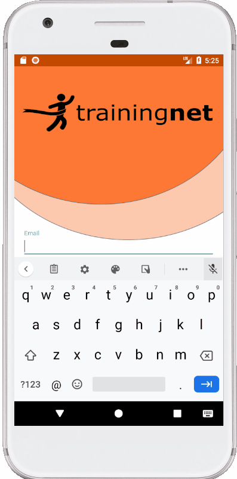

# TraineeNet
Android client app for trainees - part of TrainingPlatform project
___
The project has a modular architecture. It includes 3 modules:
* apptrainee - app for trainees who look for trainers
* apptrainer - app for trainers who can accept or reject a training proposal
* commonplatform - shared module between 2 apps above.

The app communicates with backend app, also written in Kotlin in Spring Boot 2.0.

Trainee App

Trainer App

Technologies used for this Android project:
* Coroutines & LiveData
* ViewModel
* Navigation Component
* Retrofit
* Slide to Act View (github)
* Image Slider (github)

Enjoy!
